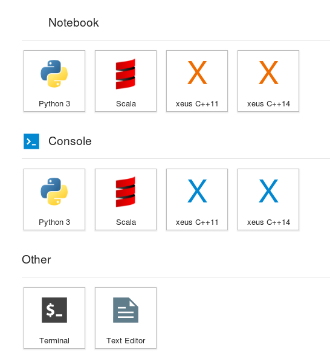

# Play interactively with C++ Programming  in [xeus-cling](https://github.com/QuantStack/xeus-cling)-a Jupyter Kernel for C++ based on xeus and cling


## Getting Started


As a start, we create a conda environment with all non-C++ dependencies and also install Jupyter Lab from conda-forge.

```bash
# Create a new conda environment
conda create -n xeus python=3.6 numpy six setuptools cython pandas \
    pytest cmake rapidjson snappy zlib brotli jemalloc lz4-c zstd ninja \
    jupyterlab -c conda-forge
source activate xeus
```

As the next step, we will install the gcc-6 compiler from QuantStack which we will use. Additionally, we install the boost-cpp build from QuantStack that was already built with gcc-6. We also set the environment variables CC and CXX so that the new compiler is picked up automatically by the build tools.

```bash
conda install gcc-6 boost-cpp -c QuantStack
export CC=${CONDA_PREFIX}/bin/gcc
export CXX=${CONDA_PREFIX}/bin/g++
```

As the last of the external dependencies, we install the actual interactive environment. For the C++ support, we install the interactive C++ compiler cling and the C++ kernel for Jupyter Notebook xeus-cling from the QuantStack channel.

```bash
conda install cling -c QuantStack -c conda-forge
conda install xeus-cling -c QuantStack -c conda-forge
```

After starting Jupyter Lab with jupyter lab, you should now see two additional kernels: xeus C++11 and xeus C++14. You can use either of them to use write interactive C++ programs.


